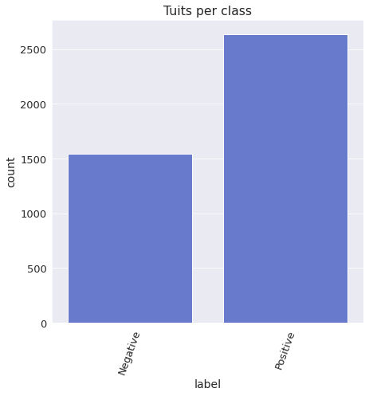
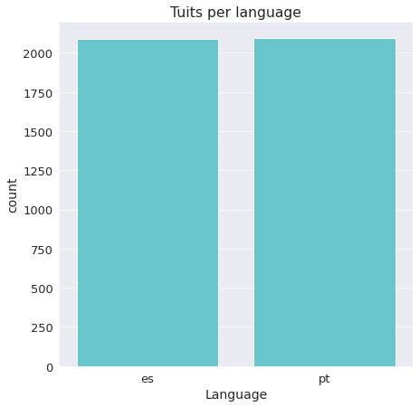
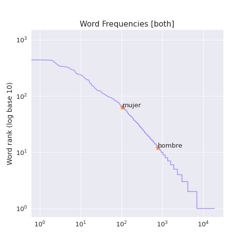
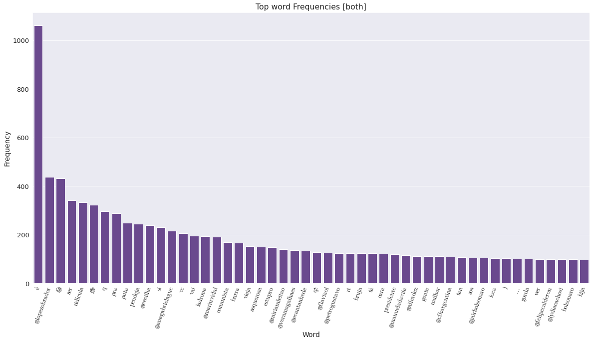
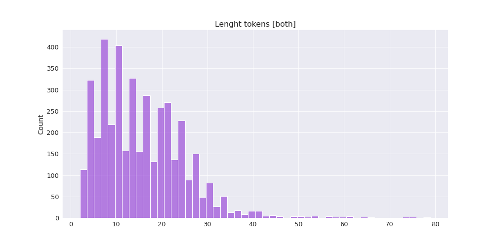
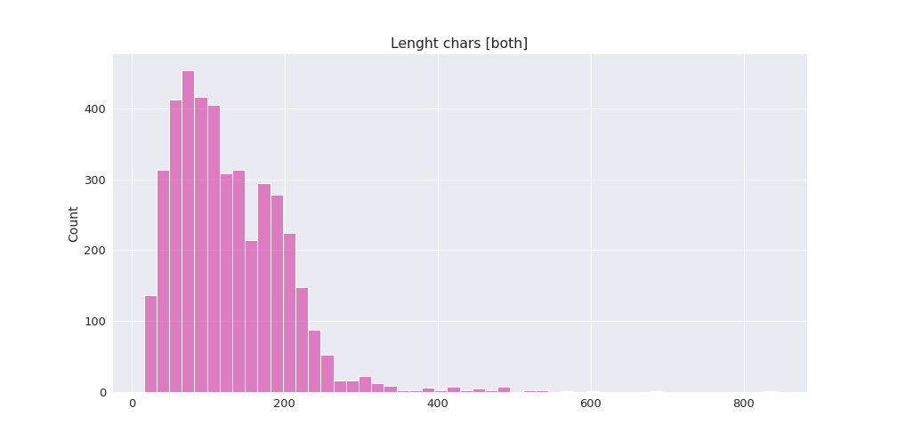
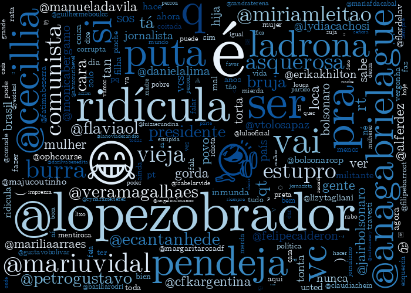
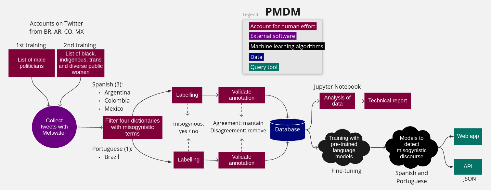

### [Español](README-ES.md) | [Inglês](README.md)
---

# Monitor do Discurso Político Misógino (PMDM em inglês)

`Political Misogynistic Discourse Monitor` é um [aplicativo da web](https://turing.iimas.unam.mx/pmdm/) e uma API que detecta discurso de ódio contra mulheres em espanhol e português.

Este projeto faz parte do [2021 JournalismAI Collab Challenges](https://blogs.lse.ac.uk/polis/2021/03/23/journalismai-collab-challenges/), uma iniciativa global que reúne organizações de mídia para explorar soluções inovadoras para melhorar o jornalismo por meio do uso de tecnologias de Inteligência Artificial. Ele foi desenvolvido como parte do grupo das Américas no Collab Challenges, que tinha como objetivo [*Como podemos usar as tecnologias de IA para inovar as técnicas de coleta de notícias e de reportagens investigativas?*](https://www.youtube.com/watch?v=wBJ9KbR-yWQ) em colaboração entre [AzMina](https://azmina.com.br/) (Brasil), [La Nación](https://www.lanacion.com.ar/data/) (Argentina), [CLIP](https://www.elclip.org/) (Colômbia) e [Data Crítica](https://datacritica.org/) (México). Em todo o percurso tivemos o apoio do [Knight Lab](https://knightlab.northwestern.edu/), da Northwestern University, para o desenvolvimento de nossos trabalhos.

[JournalismAI](https://www.lse.ac.uk/media-and-communications/polis/JournalismAI) é um projeto do [Polis](https://www.lse.ac.uk/media-and-communications/polis) – o centro de estudos em jornalismo da London School of Economics and Political Science - e é patrocinado pelo [Google News Initiative](https://newsinitiative.withgoogle.com/). Se quiser saber mais sobre Collab Challenges e outras atividades do JournalismAI, [inscreva-se na newsletter](https://mailchi.mp/lse.ac.uk/journalismai) ou entre em contato com a equipe através do e-mail hello@journalismai.info


**Membros da equipe:**

  - [Bárbara Libório](https://twitter.com/baliborio)
  - [Marina Gama Cubas](https://twitter.com/marinagamacubas)
  - [Helena Bertho Dias](https://twitter.com/helldias000)
  - [Gabriela Bouret](https://twitter.com/gabybouret)
  - [Jose Luis Peñarredonda](https://twitter.com/noalsilencio)
  - [Fernanda Aguirre](https://twitter.com/feragru)

Agradecemos a [Ivan Vladimir](https://turing.iimas.unam.mx/~ivanvladimir/) por toda ajuda no desenvolvimento do software e da aplicação web; e ao [IIMAS](https://www.iimas.unam.mx/) (Instituto de Investigaciones en Matemáticas Aplicadas e en Sistemas), da UNAM, por hospedar o projeto.

---

## Contents
- [Introdução](#introdução)
- [Dados](#dados)
  - [Criação do corpus](#criação-corpus)
  - [Classificação](#classificação)
  - [Acordo entre os verificadores](#acordo-verificadores)
- [Metodologia](#metodologia)
  - [Pré-processaento do tweets](#pre-processamento-tweets)
  - [Análise de Dados](#analise-dados)
    - [Estatísticas vocabulário](#estatisticas-vocabulario)
    - [Frequência do vocabulário](#frequencia-vocabulario)
    - [Top 50 das palavras mais frequentes](#top-50-words-frequencies)
    - [Tamanhos dos tweets](#histograms-of-length-of-tweets)
    - [Nuvem de palavras](#wordcloud)
  - [Modelos Pré-treinados](#pre-trained-models)
  - [Arquitetura do Sistema](#system-architecture)
- [Documentação da API](#api-documentation)
  - [Requests Library](#requests-library)
  - [POST Request](#post-request)
  - [Status Code](#status-code)
  - [Classifying Text](#classifying-text)
  - [Classifying Files](#classifying-files)
  - [Mias exemplos](#more-examples)
- [Trabalhos futuros](#future-work)
- [Trabalho relacionado](#related-work)
- [Bibliografia](#bibliography)

---

## Introdução

Este trabalho é uma tentativa de acelerar o desenvolvimento do  [MonitorA](https://azmina.com.br/projetos/monitora/), um projeto de [AzMina](https://azmina.com.br/) com [InternetLab](https://www.internetlab.org.br/en/) and [Institute Update](https://www.institutoupdate.org.br/en/home/), que reuniu evidências e percepções de ataques misóginos sistemáticos de candidatas nas eleições locais brasileiras de 2020.
 
De acordo com o relatório [*Violence Against Women in Politics*](https://www.unwomen.org/en/digital-library/publications/2014/6/violence-against-women-in-politics), este tipo de violência é um impedimento à participação das mulheres na esfera política, onde as mulheres de comunidades marginalizadas são afetadas de forma desproporcional. A [ONU Mulheres](https://www.unwomen.org/en/what-we-do/leadership-and-political-participation/facts-and-figures) afirma que, no contexto da América Latina, as mulheres ocupam apenas 30% dos assentos parlamentares. Além disso, a organização destaca que “a igualdade de gênero nos cargos mais altos do poder não será alcançada por mais 130 anos”. 

Os fatos mencionados nos levam a analisar como a violência contra as mulheres é perpetrada e tem impacto na sua participação. Queremos relatar esse tipo de desinformação e ataques em toda a América Latina em um esforço para motivar novas narrativas onde as mulheres tenham um espaço seguro em seu envolvimento na política.

Por esse motivo, embora este modelo de IA seja capaz de identificar a violência contra as mulheres em diferentes contextos, queremos enfocar a misoginia no discurso político como um estudo de caso na América Latina. Em nosso projeto, defendemos que a automação da detecção de discurso misógino é apenas uma ferramenta para ajudar a identificar ataques contra mulheres em meio a um grande volume de dados no Twitter. A ferramenta desenvolvida é importante para que o sistema destaque o conteúdo que pode ser analisado por um moderador humano posteriormente.

---

## Dados

Como os colaboradores são de países latino-americanos, esse modelo foi treinado com tweets em espanhol e português, postados de 2020 a 2021. Recuperamos 4.179 tweets do Twitter em formato 'csv'.

> Estão faltando 270 tweets do banco de dados que usamos para treinar o modelo e do banco de dados que compartilhamos neste repositório, pois não foi possível recuperar os IDs dessas postagens. Todos os valores da análise dos dados pertencem ao treinamento do banco de dados.

| database training | database repository |
| :-: | :-: |
| 4179 | 3909 |

1. ### Criação do corpus:

Criamos um dicionário em espanhol e outro em português com termos e frases misóginas. Junto com isso, fizemos uma lista de nomes de usuários para políticos que têm destaque nos países onde atua e um número significativo de seguidores de modo que suas postagens tenham possibilidade de maior alcance na rede. 

No entanto, consideramos que os termos e frases misóginas não seriam abrangentes o suficientes para detectar os diferentes tipos de violência verbais que as mulheres podem ser alvo na redes, por isso decidimos fazer uma segunda lista com foco nas possíveis ofensas raciais e voltada à orientação sexual (negras, indígenas e LGBTQIA+) de mulheres políticas, jornalistas e ativistas do Brasil, Argentina, Colômbia e México.  

Os tweets mencionando em ambas as listas foram coletados do Twitter usando [Meltwater](https://www.meltwater.com/en) e filtrados pelos dicionários a partir de expressões regulares.

2. ### Classificação:

  O [arquivo de dados](https://raw.githubusercontent.com/fer-aguirre/pmdm/main/data/pmdm_data.csv) possui três colunas:

  - **ID**: Como a [política do Twitter](https://developer.twitter.com/en/developer-terms/agreement-and-policy) impede o compartilhamento de mensagens de tweets, incluímos apenas o ID de cada tweet, considerando que os IDs podem ser baixados e podem ser transformados no texto original usando as ferramentas disponíveis.

  - **Classificação**:  tweets são etiquetados com o rótulo 1 se forem misóginos ou 0 se não forem. O discurso misógino foi positivo em 2.637 tweets e negativo em 1.542 tweets.

  

  - **Idioma**: Existe um rótulo para o idioma do tweet, `es` para espanhol and `pt` para português. Há 2.087 tweets em espanhol e 2.092 em português.

  

3. ### Método de classificação:

A classificação para este banco de dados de detecção de misoginia foi realizada por seis pessoas (cinco mulheres e um homem) cujos primeiros idiomas são o espanhol ou o português e que se baseiam no país de cada conjunto de dados (Brasil, Argentina, Colômbia e México). Para validar a classificação, os tweets passaram por dois verificadores separadamente. Se a verificação realizada pela segunda pessoa correspondesse com a verificação feita pela primeira, a classificação permanecia na base de dados.

---

## Metodologia

Para a criação do classificador, utilizamos cinco [Colaboratory Python Notebooks](https://drive.google.com/drive/folders/11PWsMQz1IsbttRyf90Ym37--0VU-O8r2):

- **Análise de dados:** Análise básica e estatística dos dados.
- **Treinamento e avaliação do modelos (2 versões):** Treina e avalia um modelo, um para Transformers e outro para Adapters.
- **Dados de rotulagem (2 versões):** Rotula os dados do formulário de entrada do caderno ou de um arquivo, um para Transformers e outro para Adapters.

1. ### Pré-processamento dos tweets

Há várias etapas de pré-processamento no processamento de linguagem natural que foram aplicadas aos dados:

- **Caixa Baixa:** Todas as palavras em minúscula. *(e.g., GitHub → github)*
- **Palavras irrelevantes:** Remoção de palavras que são muito comuns e que não fornecem informações úteis. *(ex.: preposições)*
- **Demojize:** Alteração de emojis para representação textual. *(ex.: ☺️ → :smiling_face:)*
- **URLs:** Substituição de URLs por `$URL$` *(ex.: https://github.com/ → $URL$)*
- **Mentions:** Substituição de menções por `$MENTION$` *(ex.: @github → $MENTION$)*
- **Hashtags:** Substituição de hashtags por `$HASHTAG$` *(ex.: #github → $HASHTAG$)*
- **Emojis:** Substituição de emojis por `$EMOJI$` *(ex.: 😃 → $EMOJI$)*
- **Smileys:** Substituição de sorrisos por `$SMILEY` *(ex.: :) → $SMILEY)*
- **Numbers:** Substituição de números por `$NUMBER$` *(ex.: 4 → $NUMBER$)*
- **Escaped characters:** Substituição de escaped characters por `$ESCAPE_CHAR$` *(ex.: char(2) → $ESCAPE_CHAR$)*

Junto com isso, seguimos uma [metodologia](https://en.wikipedia.org/wiki/Training,_validation,_and_test_sets) de aprendizado de máquina na qual usamos parte dos dados rotulados para treinar um modelo que, em seguida, é testado na outra parte dos dados. Durante o treinamento, validamos o progresso do modelo usando uma terceira parte dos dados.

| Split | Percentage | Tweets |
| :-: | :-: | :-: |
| Train | 80% | 3,343 (1673 pt, 1669 es) |
| Test | 10% | 418 (210 pt, 209 es) |
| Validation | 10% | 418 (209 pt, 209 es) |

2. ### Análise de dados 

Esta seção mostra algumas estatísticas e gráficos dos dados classificados.

- #### Estatística vocabulário

| | Frequency | Description |
| :-: | :-: | :-: |
| count | 19063 | Number of different words |
| mean | 3.444841 | The average number words appear |
| std | 13.935922 | The standard deviation associated to the words |
| min | 1 | The minimum number that a word appears |
| 25% | 1 | Up to 25% of the words appear |
| 50% | 1 | Up to 50% of the words appear |
| 75% | 2 | Up to 75% of the words appear |
| max | 1062 | The maximum number that a word appears |

- #### Frequência do vocabulário

Este gráfico mostra o vocabulário completo dos dados:



- #### Top 50 das palavras mais frequentes

Este gráfico mostra as cinquenta palavras mais comuns nos dados:



- #### Tamanho dos tweets

Estes gráficos mostram o número de tweets com um determinado comprimento:




- #### Nuvem de palavra

Esta é uma nuvem de palavras com as palavras mais comuns:



---

### Modelos Pré-Treinados

Testamos vários modelos de transformadores e adaptadores. No entanto `cardiffnlp/twitter-xlm-roberta-base` foi o que apresentou melhor desempenho no [F1 score](https://en.wikipedia.org/wiki/F-score):

| Model | Type | both | es | pt |
| :-: | :-: | :-: | :-: | :-: |
| [cardiffnlp/twitter-xlm-roberta-base](https://huggingface.co/cardiffnlp/twitter-xlm-roberta-base-sentiment) | Multilingual | ***0.8728*** | ***0.9191*** | 0.8235 |
| [neuralmind/bert-base-portuguese-cased](https://huggingface.co/neuralmind/bert-base-portuguese-cased) | Portuguese | - | - | ***0.875*** |
| [dccuchile/bert-base-spanish-wwm-uncased](https://huggingface.co/dccuchile/bert-base-spanish-wwm-uncased) | Spanish | - | 0.8985 | - |
| [mudes/multilingual-base](https://huggingface.co/mudes/multilingual-base) | Multilingual |  0.8641 | 0.8929 | 0.8339 |
| [neuralmind/bert-base-portuguese-cased](https://huggingface.co/neuralmind/bert-base-portuguese-cased) | Portuguese | - | - | 0.8496 |
| [PlanTL-GOB-ES/roberta-base-bne](https://huggingface.co/PlanTL-GOB-ES/roberta-base-bne) | Spanish | - | 0.9027 | - |

Para mais informações sobre o desempenho de todos os modelos, consulte o [relatório técnico](https://docs.google.com/document/d/1VbeUCLYFrvT02A8GIBeL_VufjtkJRgNGK54CURho8R0/).

---

- ### Arquitetura do Sistema

Esta é a estrutura de fluxo de trabalho que seguimos para o projeto:



---

## [API Documentação](https://gitlab.com/l52mas/political-misogynistic-discourse-monitor/-/tree/main/)

Para permitir a comunicação com a [API](https://turing.iimas.unam.mx/pmdm/docs), precisamos de uma biblioteca [HTTP](https://developer.mozilla.org/en-US/docs/Web/HTTP) para fazer uma solicitação-resposta. Existem algumas bibliotecas para fazer solicitações HTTP em Python. No entanto, faremos uso de solicitações por ser bem documentado e simples.

- ### Requests Library

Instalando com conda:

  ```python3
  conda install requests
  ```

Instalando com pip:

  ```python3
  pip install requests
  ```

- ### POST Request

O método POST é usado quando queremos enviar dados para serem processados no servidor. Abaixo, um exemplo de sintaxe:

`requests.post(url, headers={key: value}, json={key: value}, data={key: value})`

Para obter mais informações, consulte este [guia](https://developer.mozilla.org/en-US/docs/Web/HTTP/Methods).

- #### Valores dos parâmetros

| Parameter | Description |
| :-: | --- |
| url | A string with the endpoint |
| headers | A dict to send to the url |
| json | A dict to send to the url |
| files | A dict of files to send to the url |
| data | A dict or list of tuples to send to the url|

- ### Status Code

Mostra o resultado quando uma solicitação é enviada. As respostas podem ser agrupadas em cinco categorias:

1. Informational `100`-`199`
2. Succesful `200`-`299`
3. Redirection `300`-`399`
4. Client error `400`-`499`
5. Server error `500`-`599`

Para obter mais informações, verifique este [guia](https://developer.mozilla.org/en-US/docs/Web/HTTP/Status).

### Classifying Text 

  ```python3 
  import requests
  
  url = 'https://turing.iimas.unam.mx/pmdm/api/classify'
  
  headers = {'access-token': 'token'}
  
  tweet = {'tweet': 'text to classify'}

  response = requests.post(url, headers=headers, json=tweet)

  print(response.status_code)

  response.json()
  ``` 
Default tweet arguments:
  
  ```python3
  {
    'tweet': 'string',
    'use_lower': 'false',
    'demojize': 'true',
    'process_urls': 'true',
    'process_mentions': 'true',
    'process_hashtags': 'true',
    'process_emojis': 'false',
    'process_smileys': 'false',
    'process_numbers': 'false',
    'process_escaped_chars': 'false'
  }
```

### Classifying Files

  ```python3 
  import requests
  
  url = 'https://turing.iimas.unam.mx/pmdm/api/classify_file'
  
  headers = {'access-token': 'token'}
  
  files = {'uploaded_file': open('filename', 'rb')}
  
  # Tweet arguments required
  data = {
          'model': 'es',
          'use_lower': 'false', 
          'demojize': 'true', 
          'process_urls':'true', 
          'process_mentions': 'true', 
          'process_hashtags': 'true', 
          'process_emojis': 'false', 
          'process_smileys': 'false', 
          'process_numbers': 'false', 
          'process_escaped_chars': 'false'}

  response = requests.post(url, headers=headers, files=files, data=data)

  print(response.status_code)

  response.json()
  ``` 

### Outros exemplos

Para mais exemplos, veja este [Jupyter Notebook](https://nbviewer.org/github/fer-aguirre/pmdm/blob/main/notebooks/examples.ipynb)

---

## Trabalho futuro

Queremos criar conjuntos de dados de países latino-americanos não incluídos neste momento no interesse de manter o treinamento do modelo. Além disso, usaremos a API para agilizar a detecção e analisar instâncias de discurso misógino nas redes sociais.

Estamos cientes de que o gerenciamento de uma API ainda não é muito acessível para muitas redações da região devido a requisitos técnicos, por isso queremos documentar e metodizar aplicativos de uso que esperamos inspirar e ajudar outras organizações a trabalhar com esta ferramenta.

---

## Contate-nos

Se você quiser colaborar ou apenas saber mais sobre o projeto, por favor, entre em contato conosco: 
- barbara@azmina.com.br
- faguirre@datacritica.org 

---

## Trabalho relacionado 

[violentometro-online](https://violentometro-online.herokuapp.com/) -> [Documentação](https://github.com/violentometro-online-team/violentometro-online)

## Bibliografia

- [Datasheets for Datasets](https://arxiv.org/pdf/1803.09010.pdf)
- [Ethical and technical challenges of AI in tackling hate speech](https://informationethics.ca/index.php/irie/article/view/416/390)
- [Detección de Discurso de Odio en Redes Sociales mediante Transformers y Natural Language Processing](https://medium.com/saturdays-ai/detecci%C3%B3n-de-discurso-de-odio-en-redes-sociales-mediante-transformers-y-natural-language-processing-6c07a88b2e5f)
- [Violência Política de Gênero: as diferenças entre os ataques recebidos por mulheres e seus oponentes](https://azmina.com.br/reportagens/violencia-politica-de-genero-as-diferencas-entre-os-ataques-recebidos-por-mulheres-e-seus-oponentes/)
- [Tackling Online Abuse and Disinformation Targeting Women in Politics](https://carnegieendowment.org/2020/11/30/tackling-online-abuse-and-disinformation-targeting-women-in-politics-pub-83331)
- [#ShePersisted: why gendered disinformation](https://www.she-persisted.org/why)
