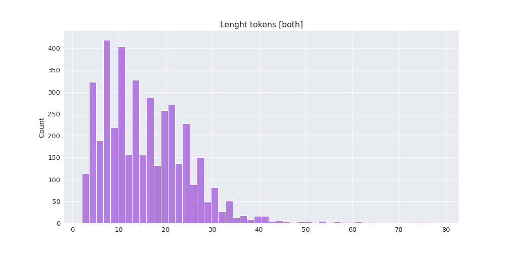
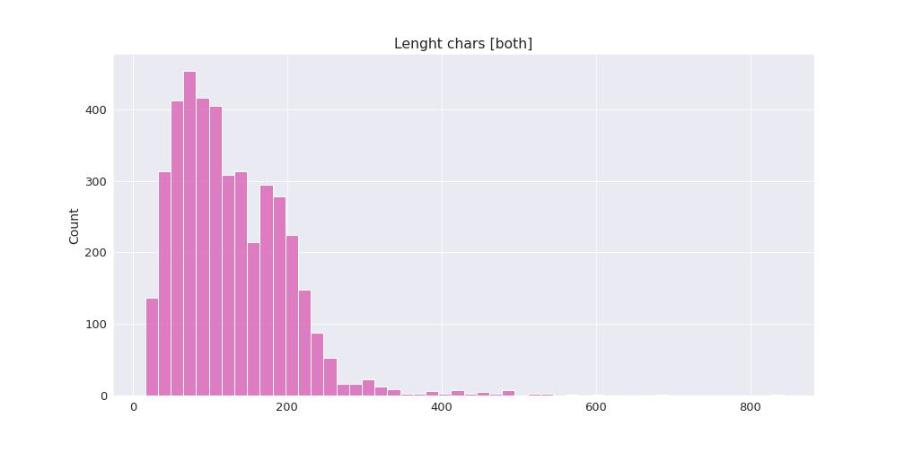

### [Español](README-ES.md) | [Português](README-PT.md)
---

# Political Misogynistic Discourse Monitor (PMDM)

`Political Misogynistic Discourse Monitor` is a [web application](https://turing.iimas.unam.mx/pmdm/) and API that detects hate speech against women in Spanish and Portuguese. 

This project is part of the [2021 JournalismAI Collab Challenges](https://blogs.lse.ac.uk/polis/2021/03/23/journalismai-collab-challenges/), a global initiative that brings together media organisations to explore innovative solutions to improve journalism via the use of AI technologies. It was developed as part of the **Americas** cohort of the Collab Challenges that focused on [*How might we use AI technologies to innovate newsgathering and investigative reporting techniques?*](https://www.youtube.com/watch?v=wBJ9KbR-yWQ) in collaboration between [AzMina](https://azmina.com.br/) (Brazil), [La Nación](https://www.lanacion.com.ar/data/) (Argentina), [CLIP](https://www.elclip.org/) (Colombia) and [Data Crítica](https://datacritica.org/) (México) with the support of the [Knight Lab](https://knightlab.northwestern.edu/) at Northwestern University.

[JournalismAI](https://www.lse.ac.uk/media-and-communications/polis/JournalismAI) is a project of [Polis](https://www.lse.ac.uk/media-and-communications/polis) – the journalism think-tank at the London School of Economics and Political Science – and it’s sponsored by the [Google News Initiative](https://newsinitiative.withgoogle.com/). If you want to know more about the Collab Challenges and other JournalismAI activities, [sign up for the newsletter](https://mailchi.mp/lse.ac.uk/journalismai) or get in touch with the team via hello@journalismai.info


**Team members:**

  - [Bárbara Libório](https://twitter.com/baliborio)
  - [Marina Gama Cubas](https://twitter.com/marinagamacubas)
  - [Helena Bertho Dias](https://twitter.com/helldias000)
  - [Gabriela Bouret](https://twitter.com/gabybouret)
  - [Jose Luis Peñarredonda](https://twitter.com/noalsilencio)
  - [Fernanda Aguirre](https://twitter.com/feragru)

We would like to thank [Ivan Vladimir](https://turing.iimas.unam.mx/~ivanvladimir/) for all his help developing the software and the web application. We also want to acknowledge [IIMAS](https://www.iimas.unam.mx/) for hosting the project.

---

## Contents

- [Introduction](#introduction)
- [Data](#data)
  - [Corpus Creation](#corpus-creation)
  - [Labelling](#labelling)
  - [Inter Annotator Agreement](#inter-annotator-agreement)
- [Methodology](#methodology)
  - [Pre-pocessing Tweets](#pre-processing-tweets)
  - [Data Analysis](#data-analysis)
    - [Vocabulary Statistics](#vocabulary-statistics)
    - [Vocabulary Frequencies](#vocabulary-frequencies)
    - [Top 50 Words Frequencies](#top-50-words-frequencies)
    - [Histograms of Length of Tweets](#histograms-of-length-of-tweets)
    - [Wordcloud](#wordcloud)
  - [Pre-trained Models](#pre-trained-models)
  - [System Architecture](#system-architecture)
- [API Documentation](#api-documentation)
  - [Requests Library](#requests-library)
  - [POST Request](#post-request)
  - [Status Code](#status-code)
  - [Classifying Text](#classifying-text)
  - [Classifying Files](#classifying-files)
  - [More Examples](#more-examples)
- [Future Work](#future-work)
- [Related Work](#related-work)
- [Bibliography](#bibliography)

---

## Introduction

This collaboration is an attempt to accelerate the development of [MonitorA](https://azmina.com.br/projetos/monitora/), a project by [AzMina](https://azmina.com.br/) with [InternetLab](https://www.internetlab.org.br/en/) and [Institute Update](https://www.institutoupdate.org.br/en/home/), which gathered evidence and insight of systematic misogynistic attacks of women candidates in Brazilian local elections of 2020. 

According to the report [*Violence Against Women in Politics*](https://www.unwomen.org/en/digital-library/publications/2014/6/violence-against-women-in-politics), this kind of violence is a deterrent to the participation of women in the political sphere, where women from marginalized communities are disproportionately affected. [UN Women](https://www.unwomen.org/en/what-we-do/leadership-and-political-participation/facts-and-figures) states that in Latin America’s context, women hold barely 30% of parliamentary seats. In addition, UN Women stands out that “gender equality in the highest positions of power will not be reached for another 130 years”. The mentioned facts lead us to analyze how the violence against women is perpetrated and has an impact in their participation. We want to report this kind of disinformation and attacks throughout Latin America in an effort to motivate new narratives where women have a safe space in their involvement in politics. 

For the above reason, although this AI model is able to identify violence against women in general, we want to focus on misogyny in political discourse as a case study in Latin America. In our project, we support that the automation of detecting misogynistic discourse is just a tool to help identifying attacks against women among a large volume of data on Twitter, so the system highlights content that can be analyzed by a human moderator afterward.

---

## Data

Since the collaborators are from Latin American countries, this model was trained with Spanish and Portuguese tweets posted from 2020 to 2021. We retrieved 4179 tweets from Twitter in 'csv' format.

> There are missing 270 tweets from the database we used to train the model and the database we share in this repository since we couldn't recover the IDs from those tweets. All the amounts from the data analysis belong to the database training.

| database training | database repository |
| :-: | :-: |
| 4179 | 3909 |

1. ### Corpus Creation:

We created a dictionary on Spanish and one on Portuguese with misogynistic terms and phrases. Along with that, we made a list of usernames for trendy politicians. However, we considered those accounts wouldn't be inclusive enough, so we decided to make a second list exclusively for diverse women (black, indigenous and LGBTQIA+) politicians, journalists and activists from Brazil, Argentina, Colombia and Mexico. Therefore tweets mentioning both lists of usernames were collected from Twitter using [Meltwater](https://www.meltwater.com/en) and filtered by the dictionaries with regular expressions.

2. ### Labelling:

  The [data file](https://raw.githubusercontent.com/fer-aguirre/pmdm/main/data/pmdm_data.csv) includes three columns:

  - **ID**: As [Twitter's policy](https://developer.twitter.com/en/developer-terms/agreement-and-policy) prevents from sharing tweets messages, we only included the ID from each tweet, considering that IDs are allowed to be downloadable and can be transformed into the original text using available tools.

  - **Classification**: Tweets are annotated with the label `1` if they are misogynistic or `0` if they are not. Misogynistic discourse were positive in 2637 tweets and negative in 1542 tweets.

  

  - **Language**: There's a label for the language of the tweet, `es` for Spanish and `pt` for Portuguese. There are 2087 tweets on Spanish and 2092 on Portuguese.

  

3. ### Inter Annotator Agreement:

The annotation for this database to detect misogyny was performed by six human annotators (five women and one man) which first languages are Spanish or Portuguese and that are based on the country of each dataset (Brazil, Argentina, Colombia and Mexico). In order to validate the annotation, all the classification labels had a checker different from the first annotator. If the checker agreed on the label, the classification remained. Otherwise, the tweet was removed from the database.

---

## Methodology

In order to create the classifier, we made use of five [Colaboratory Python Notebooks](https://drive.google.com/drive/folders/11PWsMQz1IsbttRyf90Ym37--0VU-O8r2):

- **Data analysis:** Basic analysis and statistics of the data.
- **Train and evaluate model (2 versions):** Trains a model and evaluates it, one for Transformers and another for Adapters.
- **Labelling data (2 versions):** Labels data from entry form from the notebook or from a file, one for Transformers and another for Adapters.

1. ### Pre-processing Tweets

There are several pre-processing steps on Natural Language Processing that can be applied to the data:

- **Lowers:** All words are lowered. *(e.g., GitHub → github)*
- **Stop words:** Remove words that are very common but don’t provide useful information. *(e.g., prepositions)*
- **Demojize:** Change emojis to textual representation. *(e.g., ☺️ → :smiling_face:)*
- **URLs:** Replace URLs with `$URL$` *(e.g., https://github.com/ → $URL$)*
- **Mentions:** Replace mentions with `$MENTION$` *(e.g., @github → $MENTION$)*
- **Hashtags:** Replace hashtags with `$HASHTAG$` *(e.g., #github → $HASHTAG$)*
- **Emojis:** Replace emojis with `$EMOJI$` *(e.g., 😃 → $EMOJI$)*
- **Smileys:** Replace smileys with `$SMILEY` *(e.g., :) → $SMILEY)*
- **Numbers:** Replace numbers with `$NUMBER$` *(e.g., 4 → $NUMBER$)*
- **Escaped characters:** Replace escaped characters with `$ESCAPE_CHAR$` *(e.g., char(2) → $ESCAPE_CHAR$)*

It is worth mentioning that we obtained better results lowering the text.

Along with that, we followed a machine learning [methodology](https://en.wikipedia.org/wiki/Training,_validation,_and_test_sets) in which we used part of the labelled data to train a model which then is tested on another part of the data. During training we validated the progress of the model using a third part of the data.

| Split | Percentage | Tweets |
| :-: | :-: | :-: |
| Train | 80% | 3,343 (1673 pt, 1669 es) |
| Test | 10% | 418 (210 pt, 209 es) |
| Validation | 10% | 418 (209 pt, 209 es) |

2. ### Data Analysis

This section shows some statistics and graphics of the labelled data.

- #### Vocabulary Statistics:

| | Frequency | Description |
| :-: | :-: | :-: |
| count | 19063 | Number of different words |
| mean | 3.444841 | The average number words appear |
| std | 13.935922 | The standard deviation associated to the words |
| min | 1 | The minimum number that a word appears |
| 25% | 1 | Up to 25% of the words appear |
| 50% | 1 | Up to 50% of the words appear |
| 75% | 2 | Up to 75% of the words appear |
| max | 1062 | The maximum number that a word appears |

- #### Vocabulary Frequencies

This graph shows the full vocabulary of the data:


- #### Top 50 Words Frequencies

This graph shows the fifty most common words in the data: 


- #### Histograms of Length of Tweets

These graphs show the number of tweets with a certain length:




- #### Wordcloud

This is a wordcloud with the most common words:


---

3. ### Pre-trained Models

We tested several Transformers and Adapters models. Nevertheless, `cardiffnlp/twitter-xlm-roberta-base` was the one with the better performance on [F1 score](https://en.wikipedia.org/wiki/F-score):

| Model | Type | both | es | pt |
| :-: | :-: | :-: | :-: | :-: |
| [cardiffnlp/twitter-xlm-roberta-base](https://huggingface.co/cardiffnlp/twitter-xlm-roberta-base-sentiment) | Multilingual | ***0.8728*** | ***0.9191*** | 0.8235 |
| [neuralmind/bert-base-portuguese-cased](https://huggingface.co/neuralmind/bert-base-portuguese-cased) | Portuguese | - | - | ***0.875*** |
| [dccuchile/bert-base-spanish-wwm-uncased](https://huggingface.co/dccuchile/bert-base-spanish-wwm-uncased) | Spanish | - | 0.8985 | - |
| [mudes/multilingual-base](https://huggingface.co/mudes/multilingual-base) | Multilingual |  0.8641 | 0.8929 | 0.8339 |
| [neuralmind/bert-base-portuguese-cased](https://huggingface.co/neuralmind/bert-base-portuguese-cased) | Portuguese | - | - | 0.8496 |
| [PlanTL-GOB-ES/roberta-base-bne](https://huggingface.co/PlanTL-GOB-ES/roberta-base-bne) | Spanish | - | 0.9027 | - |

For more information about all the model performances, checkout this [technical report](https://docs.google.com/document/d/1VbeUCLYFrvT02A8GIBeL_VufjtkJRgNGK54CURho8R0/).

---

4. ### System Architecture

This is the workflow structure we follow for the project:


---

## [API Documentation](https://gitlab.com/l52mas/political-misogynistic-discourse-monitor/-/tree/main/)

To enable communication with the [API](https://turing.iimas.unam.mx/pmdm/docs), we need a [HTTP](https://developer.mozilla.org/en-US/docs/Web/HTTP) library to make a request-response. There are a few libraries to make HTTP requests in Python. However, we'll make use of `requests` due to it is well-documented and simple.

- ### Requests Library

Installing package with conda:

  ```python3
  conda install requests
  ```

Installing package with pip:

  ```python3
  pip install requests
  ```

- ### POST Request

The POST method is used when we want to submit data to be processed to the server. Here's an example of the syntax:

`requests.post(url, headers={key: value}, json={key: value}, data={key: value})`

For more information about HTTP request methods, checkout this [guide](https://developer.mozilla.org/en-US/docs/Web/HTTP/Methods).

- #### Parameter Values

| Parameter | Description |
| :-: | --- |
| url | A string with the endpoint |
| headers | A dict to send to the url |
| json | A dict to send to the url |
| files | A dict of files to send to the url |
| data | A dict or list of tuples to send to the url|

- ### Status Code

The status code method shows the result when a request is sent. Responses can be grouped in five categories:

1. Informational `100`-`199`
2. Succesful `200`-`299`
3. Redirection `300`-`399`
4. Client error `400`-`499`
5. Server error `500`-`599`

For more information about HTTP response status codes, checkout this [guide](https://developer.mozilla.org/en-US/docs/Web/HTTP/Status).

### Classifying Text 

  ```python3 
  import requests
  
  url = 'https://turing.iimas.unam.mx/pmdm/api/classify'
  
  headers = {'access-token': 'token'}
  
  tweet = {'tweet': 'text to classify'}

  response = requests.post(url, headers=headers, json=tweet)

  print(response.status_code)

  response.json()
  ``` 
Default tweet arguments:
  
  ```python3
  {
    'tweet': 'string',
    'use_lower': 'false',
    'demojize': 'true',
    'process_urls': 'true',
    'process_mentions': 'true',
    'process_hashtags': 'true',
    'process_emojis': 'false',
    'process_smileys': 'false',
    'process_numbers': 'false',
    'process_escaped_chars': 'false'
  }
```

### Classifying Files

  ```python3 
  import requests
  
  url = 'https://turing.iimas.unam.mx/pmdm/api/classify_file'
  
  headers = {'access-token': 'token'}
  
  files = {'uploaded_file': open('filename', 'rb')}
  
  # Tweet arguments required
  data = {
          'model': 'es',
          'use_lower': 'false', 
          'demojize': 'true', 
          'process_urls':'true', 
          'process_mentions': 'true', 
          'process_hashtags': 'true', 
          'process_emojis': 'false', 
          'process_smileys': 'false', 
          'process_numbers': 'false', 
          'process_escaped_chars': 'false'}

  response = requests.post(url, headers=headers, files=files, data=data)

  print(response.status_code)

  response.json()
  ``` 

### More Examples

For more examples, see this [Jupyter Notebook](https://nbviewer.org/github/fer-aguirre/pmdm/blob/main/notebooks/examples.ipynb)

---

## Future Work

For future work we would like to create datasets from Latin American countries not included at this point in the interest of keeping the model's training. Furthermore, we will use the API to streamline the detection and to analyze instances of misogynistic discourse on social media.

Since we are aware that the management of an API is still not very accessible for a lot of newsrooms in the region due to technical requirements, we want to document and methodize use applications that hopefully inspire and help other organizations to work with this tool. 

---

## Contact Us

If you want to collaborate or just to know more about the project, please reach out to us: 
- barbara@azmina.com.br
- faguirre@datacritica.org 

---

## Related Work

[violentometro-online](https://violentometro-online.herokuapp.com/) -> [Documentation](https://github.com/violentometro-online-team/violentometro-online)

## Bibliography

- [Datasheets for Datasets](https://arxiv.org/pdf/1803.09010.pdf)
- [Ethical and technical challenges of AI in tackling hate speech](https://informationethics.ca/index.php/irie/article/view/416/390)
- [Detección de Discurso de Odio en Redes Sociales mediante Transformers y Natural Language Processing](https://medium.com/saturdays-ai/detecci%C3%B3n-de-discurso-de-odio-en-redes-sociales-mediante-transformers-y-natural-language-processing-6c07a88b2e5f)
- [Violência Política de Gênero: as diferenças entre os ataques recebidos por mulheres e seus oponentes](https://azmina.com.br/reportagens/violencia-politica-de-genero-as-diferencas-entre-os-ataques-recebidos-por-mulheres-e-seus-oponentes/)
- [Tackling Online Abuse and Disinformation Targeting Women in Politics](https://carnegieendowment.org/2020/11/30/tackling-online-abuse-and-disinformation-targeting-women-in-politics-pub-83331)
- [#ShePersisted: why gendered disinformation](https://www.she-persisted.org/why)